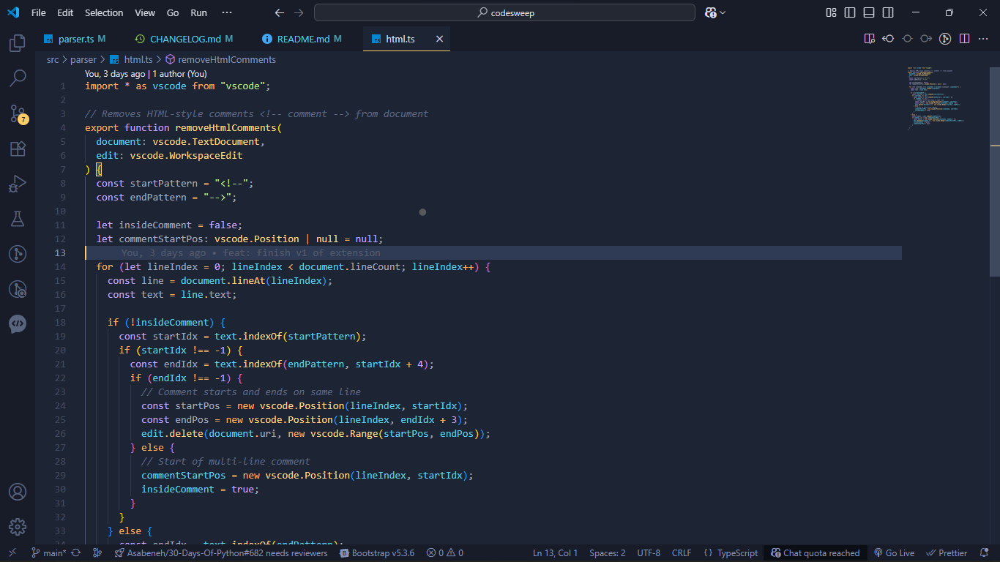

# 🧹 CodeSweep


**CodeSweep** is a lightweight, open-source VS Code extension that helps you **clean your code** by removing all comments and debug logs in one click.

> Perfect for preparing production-ready code or cleaning up before sharing with teammates.

---

## ✨ Features

- 🗑️ Remove all **single-line comments** (`//`, `#`, `--`, `;`, etc.)
- 🧼 Remove all **multi-line comments** (`/* ... */`, `<!-- ... -->`, etc.)
- 🐞 Clean up **debug statements** like `console.log`, `print()`, `System.out.println`, etc.
- 🌐 Supports 30+ popular languages (JavaScript, HTML, Python, PHP, C++, etc.)
- ⚡ Simple, fast, and effective

---

## 📦 Installation

1. Open the [VS Code Marketplace](https://marketplace.visualstudio.com/items?itemName=prince0xdev.codesweep)
2. Click **Install**

Or install via the VS Code command palette:


---

## ⚙️ Usage

- Open any code file
- Press `Ctrl+Shift+P` or `Cmd+Shift+P` on Mac
- Type and run: `CodeSweep: Clean Code`
- 💥 Done! Comments and debug logs are gone


---

# 🧩 Available Commands

CodeSweep offers 4 useful commands. You can access them all via the Command Palette (`Ctrl+Shift+P` or `Cmd+Shift+P` on Mac).

---

### 🔹 CodeSweep: Clean Code

```bash
codesweep.cleanCode
````

✅ **Recommended Command** – Runs a full cleanup of your code.

This command executes:

* Remove Multiline Comments
* Remove Debug Logs

Ideal before pushing to production or sharing your code.

---

### 🔹 CodeSweep: Remove All Comments

```bash
codesweep.removeAllComments
```

✅ Removes all single-line and multi-line comments from the entire file.

**Examples removed:**

```js
// This comment is gone
/* This too */
/*
Multi-line
block removed
*/
<!-- This in HTML is also removed -->
```

---

### 🔹 CodeSweep: Remove Single Line Comments

```bash
codesweep.removeSingleLineComments
```

✅ Only removes single-line comments, preserving multiline ones.

**Examples removed:**

```py
# A Python comment
// A JS comment
-- A SQL comment
```

---

### 🔹 CodeSweep: Remove Multiline Comments

```bash
codesweep.removeMultilineComments
```

✅ Removes only multi-line comments, useful when you want to preserve inline hints.

**Examples removed:**

```js
/*
  This block is gone
*/
// This one stays
```

```html
<!-- HTML-style comments are removed -->
```

---

### 🔹 CodeSweep: Remove Debug Logs

```bash
codesweep.removeDebugLogs
```

✅ Detects and removes debug logs like:

```js
console.log("Hello")
print("Debug")
System.out.println("Trace")
debugger;

```

And many more, depending on language.

Helps prevent accidental debug logs in production code.


## 💻 Supported Languages

Includes but not limited to:

- JavaScript, TypeScript, HTML, CSS
- Python, PHP, Ruby, Go, Rust, C/C++, Java
- Bash, PowerShell, Shell, YAML, JSONC, XML, etc.

---

## 🧠 Why CodeSweep?

Because no one wants to ship `console.log("hello")` or outdated comments to production 😉  
CodeSweep helps keep your codebase **clean, professional, and production-ready**.

---

## 🤝 Contributing
Contributions are now open!  
- 📖 Please read our [Contribution Guide](/CONTRIBUTING.md)  
- 🐛 Found a bug or have a suggestion? [Open an issue](https://github.com/prince0xdev/code-sweap/issues)
Thank you for helping make CodeSweep better! 🙌

---

## 📜 License

MIT License – free to use, modify, and distribute.

---

## 🧪 Demo

> Gif demo coming soon!


---

## 🧩 Got Feedback or Found a Bug?

Open an issue here 👉 [GitHub Issues](https://github.com/prince0xdev/codesweep/issues)